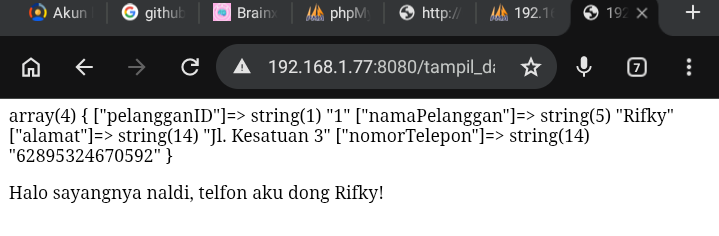
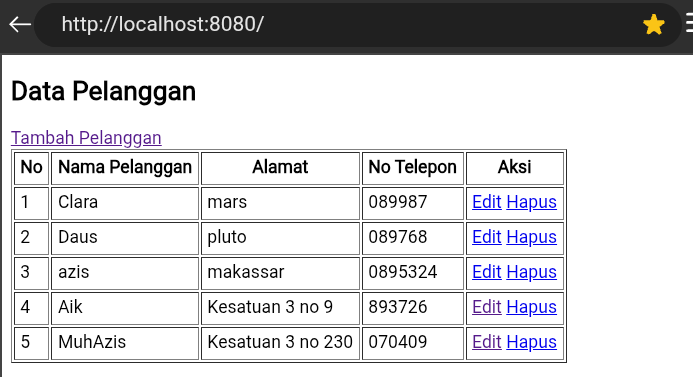
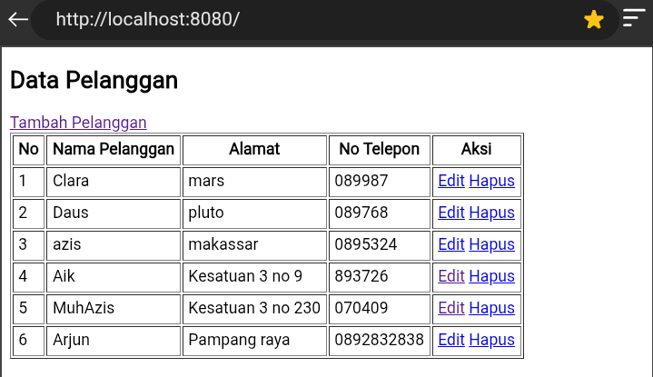
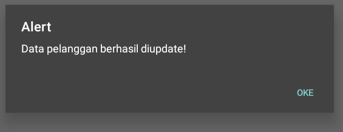
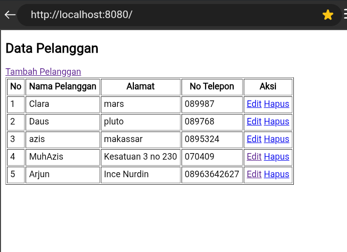

# Koneksi
## Kode program
```php
<?php
$host = "10.91.27.179";
$user = "root";
$pass = "root";
$db = "kasir_azis";

$koneksi = mysqli_connect($host, $user, $pass, $db);

if (!$koneksi){
    die("Koneksi database gagal: " . mysqli_connect_error());
} else {
  echo "koneksi berhasil";
}
?>
```

## Hasil

 

## Analisis
- `<?php` Ini adalah tag pembuka untuk menggunakan code PHP.
- `$host = "10.91.27.179";` Ini adalah variabel host dan nilai variabel nya adalah IP device saya.
- `$user = "root";` Ini adalah variabel user dan nilai variabel nya adalah username yang diperlukan untuk masuk ke database nya.
- `$pass = "root";` Variabel pass yang berisi password yang diperlukan untuk masuk ke database nya.
- `$db = "kasir_azis";` Ini adalah variabel db untuk memberitahu program bahwa database "kasir_azis" yang ingin di akses.
- `$koneksi = mysqli_connect($host, $user, $pass, $db);` Variabel koneksi yang berisi nilai salah satu fungsi didalam PHP untuk mengoneksikan file PHP dengan server database.
- `if (!$koneksi){` adalah baris kode untuk memvalidasi jika koneksi gagal terhubung.
- `die("Koneksi database gagal: " . mysqli_connect_error());` Untuk menampilkan Teks "Koneksi database gagal: " dan alasan mysql error apabila kondisi nya terpenuhi.
- `{ else }` Adalah blok apabila kondisi awal tidak terpenuhi
- `echo "Koneksi berhasil"` Berguna untuk menampilkan teks "Koneksi berhasil" apabila blok `else` terpenuhi
- `}` adalah penutup blok `else`, blok kode else berakhir disini.
- `?>` Penutup tag PHP

## Kesimpulan
File ini berfungsi untuk menghubungkan proyek website kita dengan database mysql. Dengan menggunakan fungsi dari PHP yaitu `mysqli_connect()`, kita telah mengoneksikan proyek kita dengan database yang di inginkan.

## Tampil Data Sederhana



# Tampil Pelanggan

## index.php

## Kode Program

```php
<?php
include '../config/koneksi.php';

$query = "SELECT * FROM pelanggan";
$result = mysqli_query($koneksi, $query);
?>

<!DOCTYPE html>
<html lang="en">
<head>
    <meta charset="UTF-8">
    <meta name="viewport" content="width=device-width, initial-scale=1.0">
    <title>Tampil Pelanggan</title>
</head>
<body>
    <h2>Data Pelanggan</h2>
    <a href="form_tambah.php">Tambah Pelanggan</a>

    <table border="1" cellpadding="5">
        <tr>
            <th>No</th>
            <th>Nama Pelanggan</th>
            <th>Alamat</th>
            <th>No Telepon</th>
            <th>Aksi</th>
        </tr>

        <?php $no = 1; ?>
        <?php while ($data = mysqli_fetch_assoc($result)) : ?>
            <tr>
                <td><?= $no++; ?></td>
                <td><?= $data['NamaPelanggan'] ?></td>
                <td><?= $data['Alamat'] ?></td>
                <td><?= $data['NomorTelepon'] ?></td>
                <td>
                    <a href="form_edit.php?id=<?= $data['PelangganID']; ?>">Edit</a>
                    <a href="hapus.php?id=<?= $data['PelangganID'] ?>">Hapus</a>
                </td>
            </tr>
            <?php endwhile; ?>

    </table>
</body>
</html>
```

## Hasil

Program akan menampilkan seluruh data pelanggan dalam bentuk tabel.  
Di dalam tabel terdapat:

- Nomor
    
- Nama Pelanggan
    
- Alamat
    
- Nomor Telepon
    
- Tombol Aksi (Edit dan Hapus)
    

Juda ada tombol **Tambah Pelanggan** untuk menambahkan data baru.


## Analisis

- `include '../config/koneksi.php';`  
    : Digunakan untuk memanggil file koneksi database.
    
- `$query = "SELECT * FROM pelanggan";`  
    : Query SQL untuk mengambil seluruh data dari tabel `pelanggan`.
    
- `$result = mysqli_query($koneksi, $query);`  
    : Menjalankan query SQL dan menyimpan hasilnya ke variabel `$result`.
    
- `<!DOCTYPE html>`  
    : Deklarasi bahwa dokumen menggunakan HTML5.
    
- `<title>Tampil Pelanggan</title>`  
    : Judul halaman website.
    
- `<h2>Data Pelanggan</h2>`  
    : Menampilkan judul halaman.
    
- `<a href="form_tambah.php">Tambah Pelanggan</a>`  
    : Tombol/link untuk menuju halaman tambah pelanggan.
    
- `<table border="1" cellpadding="5">`  
    : Membuat tabel dengan border dan jarak isi tabel.
    
- `<?php $no = 1; ?>`  
    : Variabel nomor urut data.
    
- `while ($data = mysqli_fetch_assoc($result))`  
    : Perulangan untuk menampilkan seluruh data pelanggan dari database.
    
- `<?= $data['NamaPelanggan'] ?>`  
    : Menampilkan nama pelanggan.
    
- `<?= $data['Alamat'] ?>`  
    : Menampilkan alamat pelanggan.
    
- `<?= $data['NomorTelepon'] ?>`  
    : Menampilkan nomor telepon pelanggan.
    
- `<a href="form_edit.php?id=<?= $data['PelangganID']; ?>">Edit</a>`  
    : Link untuk mengedit data pelanggan.
    
- `<a href="hapus.php?id=<?= $data['PelangganID'] ?>">Hapus</a>`  
    : Link untuk menghapus data pelanggan.
    

## Kesimpulan

Program ini digunakan untuk menampilkan seluruh data pelanggan dari database ke dalam bentuk tabel HTML.  Pengguna juga dapat menambah, mengedit, dan menghapus data pelanggan melalui menu aksi.


# Tambah Pelanggan

## Form_Tambah.php

### Kode Program

```html
<!DOCTYPE html>
<html lang="en">
<head>
    <meta charset="UTF-8">
    <meta name="viewport" content="width=device-width, initial-scale=1.0">
    <title>tambah pelanggan</title>
</head>
<body>
    <h1>Tambah Pelanggan</h1>

    <form method="post" action="tambah.php">
        Nama Pelanggan <br>
        <input type="text" name="nama" required><br><br>

        Alamat <br>
        <textarea name="alamat" required></textarea><br><br>

        No Telepon <br>
        <input type="text" name="telp" required><br><br>

        <button type="submit" name="simpan">Simpan</button>
    </form>
    
</body>
</html>
```

## Hasil

Program akan menampilkan form tambah pelanggan yang berisi:

- Input nama pelanggan
    
- Input alamat
    
- Input nomor telepon
    
- Tombol simpan
    

Lalu data yang diisi pengguna akan dikirim ke file `tambah.php`.


## Analisis

- `<!DOCTYPE html>`  
    : Deklarasi bahwa dokumen menggunakan HTML5.
    
- `<html lang="en">`  
    : Menentukan bahasa halaman HTML.
    
- `<meta charset="UTF-8">`  
    : Mengatur encoding karakter menjadi UTF-8.
    
- `<meta name="viewport" content="width=device-width, initial-scale=1.0">`  
    : Membuat tampilan website responsif di berbagai perangkat.
    
- `<title>tambah pelanggan</title>`  
    : Judul halaman website.
    
- `<h1>Tambah Pelanggan</h1>`  
    : Menampilkan heading atau judul halaman.
    
- `<form method="post" action="tambah.php">`  
    : Membuat form dengan metode `POST` dan mengirim data ke file `tambah.php`.
    
- `<input type="text" name="nama" required>`  
    : Input untuk mengisi nama pelanggan.
    
- `<textarea name="alamat" required></textarea>`  
    : Input area teks untuk mengisi alamat pelanggan.
    
- `<input type="text" name="telp" required>`  
    : Input untuk mengisi nomor telepon pelanggan.
    
- `<button type="submit" name="simpan">Simpan</button>`  
    : Tombol untuk menyimpan data pelanggan.
    
- `required`  
    : Menandakan bahwa input wajib diisi sebelum form dikirim.
    

## Kesimpulan

Program ini digunakan untuk menampilkan form penambahan data pelanggan.  
Data yang diinput pengguna akan dikirim ke file `tambah.php` untuk diproses dan disimpan ke database.


## Tambah.php

### Kode Program

```php
<?php
include '../config/koneksi.php';

if (isset($_POST['simpan'])){
    $nama   = $_POST['nama'];
    $alamat   = $_POST['alamat'];
    $telp   = $_POST['telp'];

    $sql = "INSERT INTO pelanggan
    (NamaPelanggan, Alamat, NomorTelepon)
    VALUES ('$nama', '$alamat', '$telp')";

    $query = mysqli_query($koneksi, $sql);

    header('location: index.php');
    
} else {
    die("Akses dilarang");
}

?>
```

## Hasil

Program akan menyimpan data pelanggan yang diinput dari form ke dalam database.  
Setelah data berhasil disimpan, halaman akan otomatis berpindah ke `index.php`.



## Analisis

- `include '../config/koneksi.php';`  
    : Digunakan untuk memanggil file koneksi database.
    
- `if (isset($_POST['simpan']))`  
    : Mengecek apakah tombol simpan pada form telah ditekan.
    
- `$nama = $_POST['nama'];`  
    : Mengambil data nama pelanggan dari form.
    
- `$alamat = $_POST['alamat'];`  
    : Mengambil data alamat pelanggan dari form.
    
- `$telp = $_POST['telp'];`  
    : Mengambil data nomor telepon pelanggan dari form.
    
- `$sql = "INSERT INTO pelanggan ..."`  
    : Query SQL untuk menambahkan data baru ke tabel `pelanggan`.
    
- `VALUES ('$nama', '$alamat', '$telp')`  
    : Data yang akan dimasukkan ke database.
    
- `$query = mysqli_query($koneksi, $sql);`  
    : Menjalankan query tambah data ke database.
    
- `header('location: index.php');`  
    : Mengalihkan halaman ke `index.php` setelah data berhasil disimpan.
    
- `else`  
    : Akan dijalankan jika file tidak diakses melalui form.
    
- `die("Akses dilarang");`  
    : Menampilkan pesan bahwa akses tidak diperbolehkan.
    

## Kesimpulan

Program ini digunakan untuk memproses penambahan data pelanggan ke database.  
Data yang dikirim dari form akan disimpan ke tabel `pelanggan`, kemudian pengguna akan diarahkan kembali ke halaman utama.

# Edit Pelanggan
## form_edit.php
### Kode Program
```php
<?php
include '../config/koneksi.php';
$id = $_GET['id'];
$query = "SELECT * FROM pelanggan where PelangganID='$id'";
$result = mysqli_query($koneksi, $query);

$data = mysqli_fetch_assoc($result);
?>

<!DOCTYPE html>
<html lang="en">
<head>
    <meta charset="UTF-8">
    <meta name="viewport" content="width=device-width, initial-scale=1.0">
    <title>edit pelanggan</title>
</head>
<body>
    <h1>Edit Pelanggan</h1>

    <form method="post" action="edit.php">
        <!-- Input hidden untuk mengirimkan ID ke proses edit -->
        <input type="hidden" name="PelangganId" value="<?= $data['PelangganID'] ?>">
        
        Nama Pelanggan <br>
        <input type="text" name="NamaPelanggan" value="<?= $data['NamaPelanggan'] ?>" required><br><br>

        Alamat <br>
        <textarea name="Alamat" required><?= $data['Alamat'] ?></textarea><br><br>

        No Telepon <br>
        <input type="text" name="NomorTelepon" value="<?= $data['NomorTelepon'] ?>" required><br><br>

        <button type="submit" name="update">Simpan</button>
    </form>
    
</body>
</html>

```
### Hasil
Program akan menampilkan form edit yang sudah terisi otomatis dengan data lama pelanggan berdasarkan ID yang dipilih. Pengguna dapat mengubah data tersebut, lalu menekan tombol "Simpan" untuk memperbarui data di database.

### Analisis
 * `$id = $_GET['id'];` Mengambil ID pelanggan yang dikirim melalui parameter URL (method GET) dari halaman daftar pelanggan.
 * `SELECT * FROM pelanggan where PelangganID='$id'`: Query SQL untuk mencari data pelanggan spesifik yang memiliki ID tersebut.
 * `mysqli_fetch_assoc($result)`: Mengambil data hasil query ke dalam bentuk array agar bisa ditampilkan di form.
 * `value="<?= $data['NamaPelanggan'] ?>"`: Memasukkan data dari database ke dalam atribut value input teks sehingga data lama muncul secara otomatis.
 * `<input type="hidden">`: Menyimpan ID pelanggan secara tersembunyi agar ID tersebut tetap terkirim saat form disubmit tanpa bisa diubah oleh pengguna di tampilan.
### Kesimpulan
File ini berfungsi sebagai antarmuka (interface) bagi pengguna untuk melakukan perubahan pada data pelanggan tertentu. Dengan memanfaatkan method GET untuk identifikasi ID dan array asosiatif untuk menampilkan data lama, proses penyuntingan data menjadi lebih mudah dan akurat.

## edit.php
### Kode Program
```php
<?php
include '../config/koneksi.php';
if (isset($_POST['update'])) {
    $id = $_POST['PelangganId'];
    $nama = $_POST['NamaPelanggan'];
    $alamat = $_POST['Alamat'];
    $telepon = $_POST['NomorTelepon'];

    $query = "UPDATE pelanggan SET
                NamaPelanggan='$nama',
                Alamat='$alamat',
                NomorTelepon='$telepon'
              WHERE PelangganId='$id'";
    $update = mysqli_query($koneksi, $query);
    if ($update) {
        echo "
        <script>
            alert('Data pelanggan berhasil diupdate!');
            window.location.href='index.php';
        </script>
        ";
    } else {
        echo "
        <script>
            alert('Data gagal diupdate!');
            window.location.href='form_edit.php?id=$id';
        </script>
        ";
    }
} else {
    die('Akses dilarang...');
}
?>

```
### Hasil
Program akan memproses pembaruan data ke dalam database. Jika berhasil, sistem akan menampilkan pesan peringatan (alert) bahwa data berhasil diupdate, kemudian halaman akan dialihkan kembali ke index.php.


### Analisis
 * `if (isset($_POST['update']))`: Memastikan bahwa data dikirimkan melalui tombol submit yang benar (method POST).
 * `$id = $_POST['PelangganId'];`: Mengambil data yang dikirim dari form, termasuk ID pelanggan yang disembunyikan sebelumnya.
 * `UPDATE pelanggan SET ... WHERE PelangganId='$id'`: Perintah SQL untuk mengubah nilai kolom NamaPelanggan, Alamat, dan NomorTelepon hanya pada baris yang memiliki ID yang sesuai.
 * `alert('...')`: Memberikan konfirmasi kepada pengguna mengenai sukses atau gagalnya proses update.
 * `window.location.href`: Mengalihkan halaman menggunakan JavaScript.
### Kesimpulan
File ini berfungsi sebagai pemroses logika untuk memperbarui data pelanggan. Tanpa file ini, perubahan yang dilakukan pada form edit tidak akan tersimpan secara permanen ke dalam database.
# Hapus Pelanggan
## hapus.php
### Kode Program
```php
<?php
include '../config/koneksi.php';

if (isset($_GET['id'])) {
    $id = $_GET['id'];

    $sql = "DELETE FROM pelanggan WHERE PelangganId='$id'";
    mysqli_query($koneksi, $sql);
    header ('Location: index.php');
} else {
    die("Akses dilarang..");
}
?>

```
### Hasil
Saat link "Hapus" pada halaman daftar pelanggan diklik, program akan menghapus baris data tersebut dari database. Setelah itu, pengguna akan langsung diarahkan kembali ke halaman utama (index.php) dan data tersebut tidak lagi terlihat di tabel. Sebagai contoh, saya akan menghapus pengguna "Aik".

### Analisis
 * `if (isset($_GET['id']))`: Mengecek apakah ada parameter ID yang dikirim melalui URL.
 * `$id = $_GET['id'];`: Mengambil ID data yang akan dihapus.
 * `DELETE FROM pelanggan WHERE PelangganId='$id'`: Query SQL untuk menghapus data secara permanen dari tabel pelanggan berdasarkan ID.
 * `header ('Location: index.php')`: Mengarahkan kembali ke halaman index secara otomatis setelah query dijalankan.
### Kesimpulan
File ini berfungsi untuk menghapus data pelanggan secara permanen dari sistem. Proses ini sangat efisien karena hanya membutuhkan ID pelanggan sebagai acuan untuk menjalankan perintah penghapusan data.

